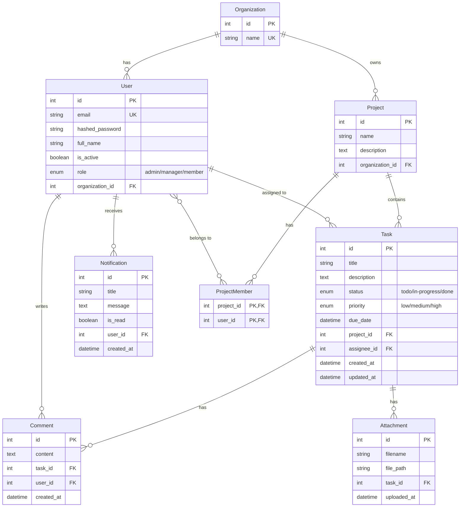

# Entity Relationship Diagram

## Database Schema

## Relationships

| Relationship | Type | Description |
|--------------|------|-------------|
| Organization → User | One-to-Many | An organization has many users |
| Organization → Project | One-to-Many | An organization has many projects |
| Project → Task | One-to-Many | A project contains many tasks |
| Project ↔ User | Many-to-Many | Users can be members of multiple projects (via ProjectMember) |
| Task → User | Many-to-One | A task is assigned to one user |
| Task → Comment | One-to-Many | A task can have many comments |
| Task → Attachment | One-to-Many | A task can have max 3 attachments |
| User → Notification | One-to-Many | A user receives many notifications |

## Indexes

- `organization.name` - Unique index
- `user.email` - Unique index
- `user.organization_id` - Foreign key index
- `project.organization_id` - Foreign key index
- `task.project_id` - Foreign key index
- `task.assignee_id` - Foreign key index
- `task.status` - Index for filtering
