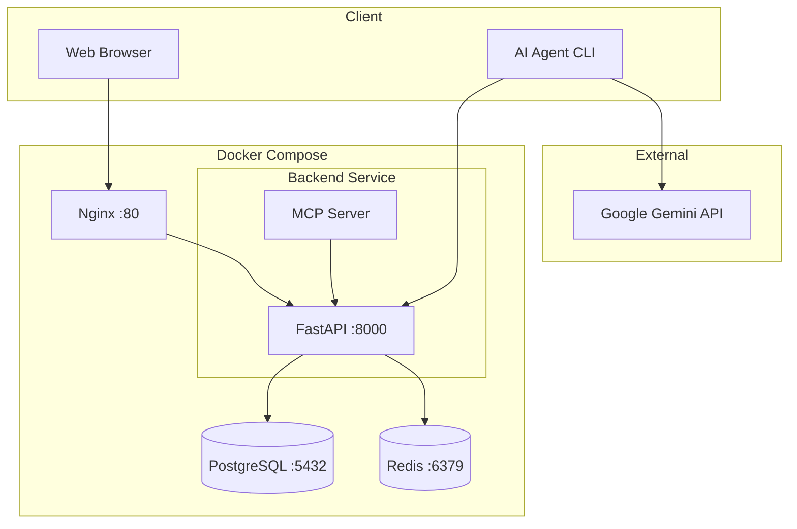
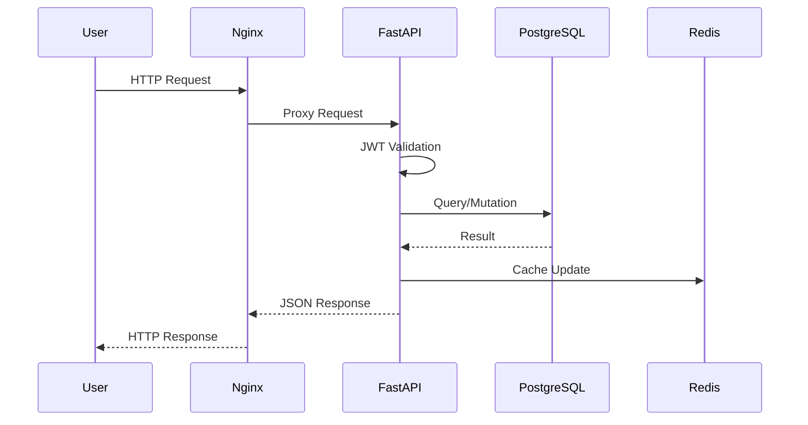
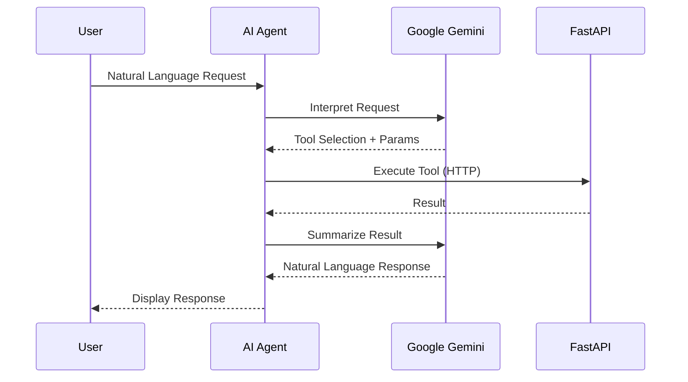

# System Design

## Architecture Overview

## Component Details

### 1. Nginx (Reverse Proxy)
- **Port**: 80
- **Role**: Load balancing, SSL termination, static file serving
- Routes all `/api` requests to FastAPI backend

### 2. FastAPI Backend
- **Port**: 8000 (internal)
- **Features**:
  - RESTful API endpoints
  - JWT Authentication
  - Role-based Access Control (RBAC)
  - Swagger UI documentation (`/docs`)
  - Health check endpoint (`/health`)

### 3. PostgreSQL Database
- **Port**: 5432
- **Role**: Primary data storage
- **Tables**: Organization, User, Project, Task, Comment, Attachment, Notification

### 4. Redis
- **Port**: 6379
- **Role**: Caching, session storage, notification queue

### 5. MCP Server
- Auto-discovers FastAPI routes
- Exposes all endpoints as MCP tools
- Used by AI Agent for tool execution

### 6. AI Agent
- Uses Google Gemini for natural language understanding
- Calls MCP tools via HTTP
- Interactive CLI for task management

## Request Flow

## AI Agent Flow

## Security

- **Authentication**: JWT tokens with configurable expiration
- **Authorization**: Role-based (Admin, Manager, Member)
- **Password**: Bcrypt hashing
- **CORS**: Configurable origins
- **File Uploads**: Size limit (5MB), count limit (3 per task)

## Scaling Considerations

- **Horizontal**: Multiple FastAPI instances behind Nginx
- **Database**: PostgreSQL connection pooling
- **Caching**: Redis for frequently accessed data
- **Files**: External storage (S3) for attachments in production
